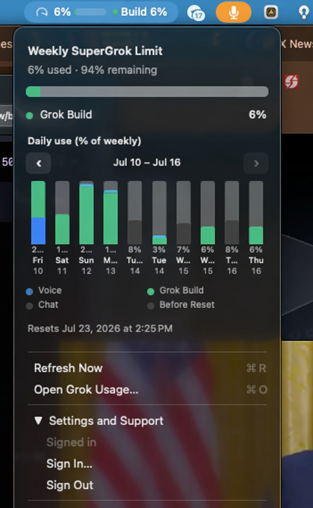
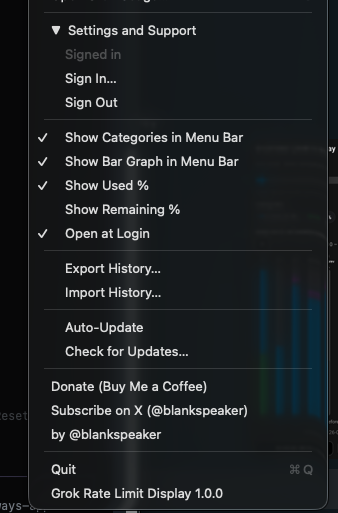
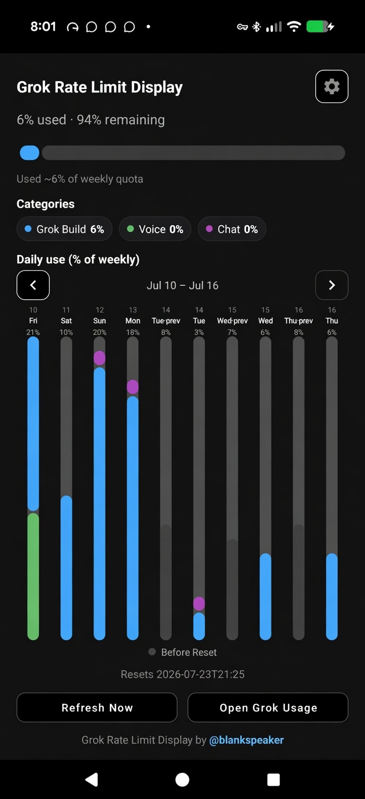
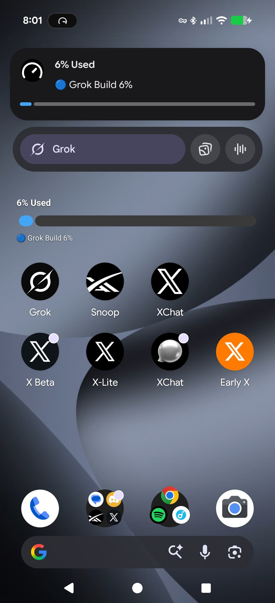

# Grok Rate Limit Display (GRLD)

**Version 1.0.1** — macOS menu bar + Android status notification for your **weekly SuperGrok usage**.

By [@blankspeaker](https://x.com/blankspeaker).


> Unofficial third-party apps. **Not** affiliated with, supported, or endorsed by SpaceXAI / Grok. **Use at your own risk.**

## Screenshots

### macOS

Menu bar popup with weekly usage, category breakdown, daily chart, and **Before Reset** legend — plus settings (categories in menu bar, bar graph, auto-update, import/export history).

<p align="center">
  
  &nbsp;
  
</p>

### Android

In-app dashboard with categories and daily chart, plus **home-screen widget** and **Live Update / status notification** (works on lock screen and Always On Display).

<p align="center">
  
  &nbsp;
  
</p>

## Who this works for

A **SuperGrok** or **SuperGrok Heavy** plan is required to access usage limits.

## Sign in

1. **Android:** open the app → **Sign In**  
   **macOS:** menu bar gauge → **Sign In to Grok…**
2. Complete sign-in in your **browser** (enter the on-screen code if asked)
3. Return to the app — weekly usage loads automatically

Tokens stay on your device only. Sign out anytime from Settings (Android) or the menu (macOS).

If sign-in says there were too many attempts, wait a minute and try once more.

## Install — macOS (Apple Silicon)

1. Download **[GRLD-macOS-arm64.dmg](https://github.com/blankspeaker/Grok-Rate-Limit-Display/raw/main/Binaries/GRLD-macOS-arm64.dmg)**
2. Open the DMG → drag **Grok Rate Limit Display** to Applications
3. Open from Applications (if Gatekeeper blocks: **right-click → Open**)
4. Sign in from the menu bar

Requires **macOS 13+** and **Apple Silicon (arm64)**.

Optional: **Auto-Update** in the app menu checks this repo’s `Binaries/mac-latest.json`.

## Install — Android

### Recommended: `adb`

- [Android platform-tools](https://developer.android.com/tools/releases/platform-tools) (`adb`)
- Phone: **Developer options → USB debugging**
- **Android 8+** (API 26)

```bash
adb devices
adb install -r Binaries/GRLD-android.apk
# or after downloading:
adb install -r GRLD-android.apk
```

Direct APK: **[GRLD-android.apk](https://github.com/blankspeaker/Grok-Rate-Limit-Display/raw/main/Binaries/GRLD-android.apk)**

Open the app → **Sign In** → allow notifications (and Live Updates if offered).

### Installing from the browser (Play Protect)

Sideloaded APKs may show a Play Protect warning. That is normal for apps **not** on the Play Store. Prefer `adb install` when you can, or build from source with your own keystore ([android/README.md](android/README.md)).

This project is **not** published on Google Play. Use at your own risk.

## Features

| | macOS | Android |
|--|:-----:|:-------:|
| Weekly used / remaining % | ✓ | ✓ |
| Live gauge / status indicator | ✓ | ✓ |
| Category breakdown | ✓ | ✓ |
| Daily history chart | ✓ | ✓ |
| Browser sign-in | ✓ | ✓ |
| Auto-update from this repo | ✓ | use `adb install -r` |

## Repository layout

```
Grok-Rate-Limit-Display/
├── README.md
├── LICENSE
├── Binaries/          prebuilt downloads + version manifests
├── docs/screenshots/  README images
├── macos/
└── android/
```

## Build from source

- **macOS:** [macos/README.md](macos/README.md)
- **Android:** [android/README.md](android/README.md)

Release signing keys are never committed. Maintainers keep keystores outside the tree (e.g. `~/.grld/`).

## Privacy

- No analytics or telemetry
- Auth tokens stay on your device only
- Network only to SpaceXAI auth / Grok billing APIs and links you open
- This repository contains no user tokens or personal account data

## Support

| | |
|--|--|
| ☕ Buy Me a Coffee | [buymeacoffee.com/blank_speaker](https://buymeacoffee.com/blank_speaker) |
| 𝕏 Subscribe | [Creator subscription](https://x.com/blankspeaker/creator-subscriptions/subscribe) |
| 𝕏 Follow | [@blankspeaker](https://x.com/intent/follow?screen_name=blankspeaker) |

## Related

- Browser extension: [Grok Rate Limit Display](https://chromewebstore.google.com/detail/fcoijmefliggikpeofhojmkpoooocifk?utm_source=item-share-cb) on the Chrome Web Store

## License

MIT — see [LICENSE]
